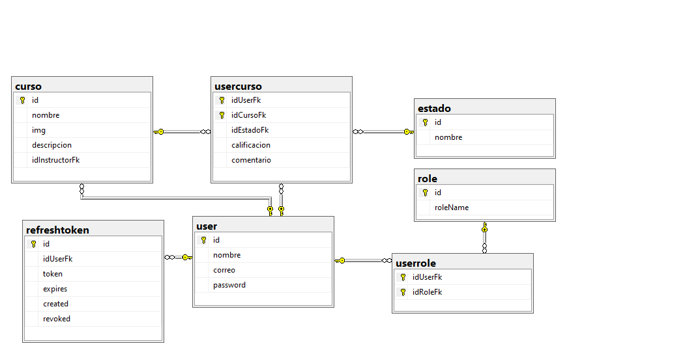

# Plataforma de Evaluación de Cursos en Línea

Aplicación web que permite a los usuarios acceder a cursos en línea y realizar evaluaciones asociadas. Laplataforma incluye autenticacion para garantizar la privacidad de los usuarios

**Table of Contents**📑

[TOCM]

[TOC]

## Descripcion del proyecto 🌟

El proyecto se basa en dos componentes principales, BackEnd y FrontEnd.
El primero es un proyecto API que se implementa con NETCORE - EntityFramework, estructurado a 4 capas para garantizar su robustes y escalabilidad, su base datos se implementa con Microsoft SQL Server, el archivo del script de la DB se encuentra en la carpeta Db, dentro de BackCursps.
La segunda es un proyecto Web Assembly con Blazor, lo que permite que el front se ejecute desde el usuario, implementa una estructura por componentes con unica capa. 

## Caracteristicas 📈

El Proyecto incluye Versionado, RateLimit, JWT

## Tecnologias 💻

-   NetCore 7.0
-   Blazor
-   MySQL
-   GitHub

### Lenguajes Usados 💬

-   C#
-   Razor

### Dependencias Usadas 📦

#### Dependencias del FrontEnd
-   "Microsoft.AspNetCore.Components.WebAssembly"
-   "Microsoft.AspNetCore.Components.WebAssembly.DevServer" Version="7.0.10"
-   "Microsoft.AspNetCore.Http" Version="2.2.2"
-   "Newtonsoft.Json" Version="13.0.3"

#### Dependencias del BackEnd
-   "AspNetCoreRateLimit" Version="5.0.0"
-   "AutoMapper.Extensions.Microsoft.DependencyInjection" Version="12.0.1"
-   "Microsoft.AspNetCore.Authentication.JwtBearer" Version="7.0.12"
-   "Microsoft.AspNetCore.Mvc.Versioning" Version="5.1.0"
-   "Microsoft.AspNetCore.OpenApi" Version="7.0.12"
-   "Microsoft.EntityFrameworkCore" Version="7.0.12"
-   "Microsoft.EntityFrameworkCore.Design" Version="7.0.12">
-   "Microsoft.Extensions.DependencyInjection" Version="7.0.0"
-   "Swashbuckle.AspNetCore" Version="6.5.0"
-   "System.IdentityModel.Tokens.Jwt" Version="7.0.3"
-   "Microsoft.IdentityModel.Tokens" Version="7.0.3"
-   "Serilog.AspNetCore" Version="7.0.0"
-   "FluentValidation.AspNetCore" Version="11.3.0"
-   "itext7.pdfhtml" Version="5.0.1"
-   "Pomelo.EntityFrameworkCore.MySql" Version="7.0.0"
-   "CsvHelper" Version="30.0.1"

## Estructura de la DataBase 🧱

> Estructura General.

